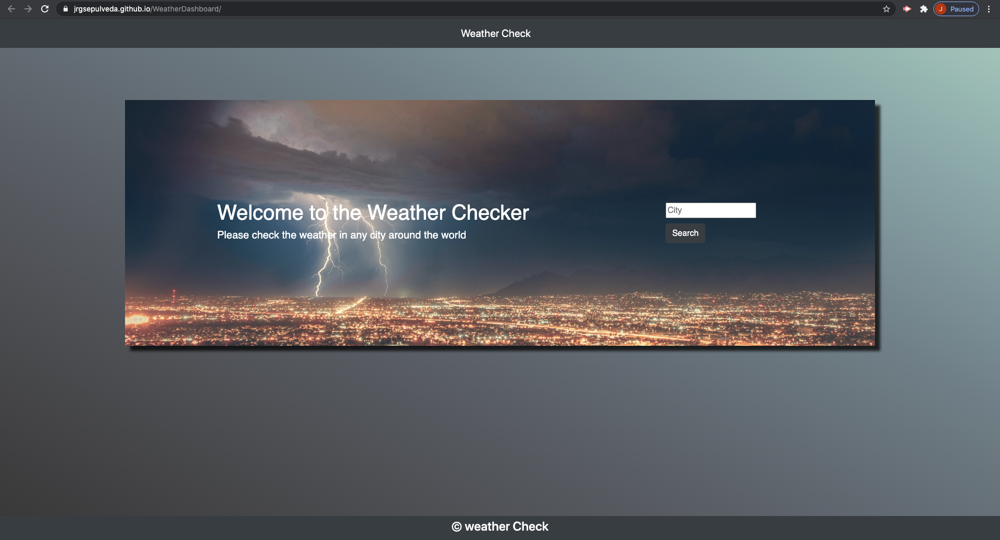

# WeatherDashboard
This website will let you check the weather in any city around the world. It get its data from Open Weather API. Your searches will be save to local storage and will be present when you reload the page. https://jrgsepulveda.github.io/WeatherDashboard/

